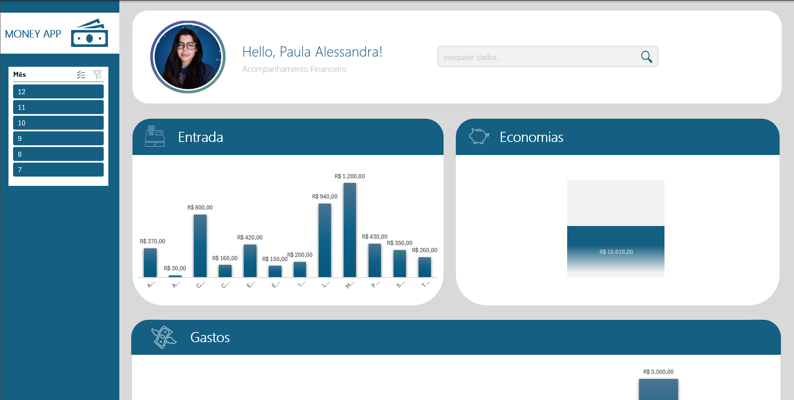
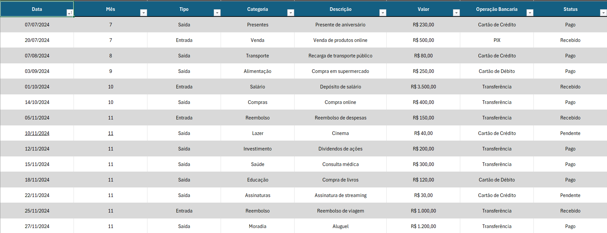

# 📊 Money App: Sua Carteira Financeira no Excel  

## 🚀 Visão Geral  
Este projeto é um **dashboard interativo no Excel** que funciona como um app de **controle financeiro pessoal**. Ele foi desenvolvido para ajudar no **gerenciamento de gastos**, **planejamento econômico** e **monitoramento de metas financeiras**, tudo de forma simples e visual.  

## 🎯 Objetivos  
- Criar um **controle financeiro acessível** para pessoas que desejam organizar suas finanças.  
- Simular funcionalidades de um **aplicativo de carteira** usando apenas o Excel.  
- Desenvolver uma interface **intuitiva e interativa** para análise de dados financeiros.  

## 🛠️ Funcionalidades  
- **Visão Geral do Saldo**: Mostra receitas, despesas e saldo atual.  
- **Controle de Despesas**: Categorias como alimentação, transporte, lazer, etc.  
- **Gráficos Interativos**: Para acompanhar a evolução das finanças.  
- **Metas Financeiras**: Acompanhe seu progresso em direção aos objetivos.  

## 📂 Estrutura do Arquivo  
- **Dashboard Principal**: Interface inicial com resumo financeiro e gráficos interativos.  
- **Tabela de Transações**: Área para inserir e gerenciar receitas e despesas.  

## 💡 Como Usar  
1. Faça o download do arquivo Excel.  
2. Preencha suas receitas e despesas na **Tabela de Transações**.   
3. Acompanhe seu progresso no **Dashboard Principal**.  

## 🛑 Requisitos  
- Microsoft Excel 2016 ou superior.  
- Habilitar **macros** (se aplicável) para funcionalidades avançadas.  

## 🎨 Design e Usabilidade  
O dashboard foi projetado para ser **clean e minimalista**, garantindo uma experiência agradável e fácil de usar.  

- **Gráficos Dinâmicos**: Utilização de gráficos e tabelas dinâmicas para visualização.  

## 📈 Tecnologias Utilizadas  
- **Excel**: Gráficos, tabelas dinâmicas e formatação condicional.  

## 📸 Como ficou 
### Dashboard Principal  
  

### Tabela de Transações  
  

## 🏆 Aprendizados  
Durante o desenvolvimento, pude:  
- Aperfeiçoar habilidades em **Excel avançado**.  
- Aplicar conceitos de **UX/UI** em ferramentas de produtividade.  
- Entender melhor a importância do **planejamento financeiro pessoal**.  

## 🌟 Próximos Passos  
- Adicionar suporte para **conversão de moedas**.  
- Integrar com APIs financeiras para importar transações automaticamente.  
- Criar versão para **Google Sheets**.  

## 📩 Contato  
Se tiver dúvidas ou sugestões, entre em contato:  
- **Email**: [paulaalessandra_rodrigues@outlook.com](mailto:paulaalessandra_rodrigues@outlook.com)  
- **LinkedIn**: [paulaalessandrars](https://www.linkedin.com/in/paulaalessandrars/)  

---
**"Planejar é o primeiro passo para a liberdade financeira!"**  
